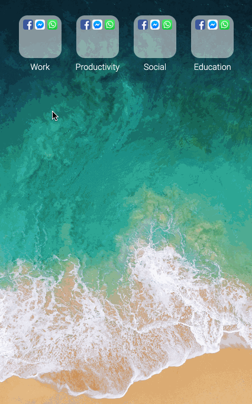

# react-ios-springboard



## steps

- `yarn add -D parcel-bundler`
- package.json

```json
{
  "scripts": {
    "watch": "parcel src/index.html"
  }
}
```

```html
// src/index.html
<!DOCTYPE html>
<html>
<head>
  <title>React iOS Springboard</title>
</head>
<body>
  <div id="app"></div>
  <script src="./index.js"></script>
</body>
</html>
```

```js
import React from 'React';
import { render } from 'react-dom';

render(<h1>Working</h1>, document.getElementById('app'));
```

- `yarn watch` 让 parcel 自动帮我们安装依赖

```js
// Root 组件，这也是一种创建方式吧
// src/components/Root/index.js
import Root from './Root';
export default Root;

// src/components/Root/Root.js
import React from 'react';

const Root = () => {
  return <h1>Root</h1>;
};

export default Root;
```

### 全局css初始化组件

```js
const GlobalStyle = createGlobalStyle`
  @import url('https://fonts.googleapis.com/css?family=Roboto:300&display=swap');

  html, body {
    margin: 0;
    padding: 0;
  }

  html, body, #app {
    width: 100%;
    height: 100%;
  }

  body {
    font-family: Roboto, sans-serif;
    font-weight: 300;
  }
`;
```

### Folder 组件

```js
const Springboard = ({ folders }) => {
  return <Wrapper>
    {folders.map(folder => (
      <Folder key={folder.id}/>
    ))}
  </Wrapper>;
};
