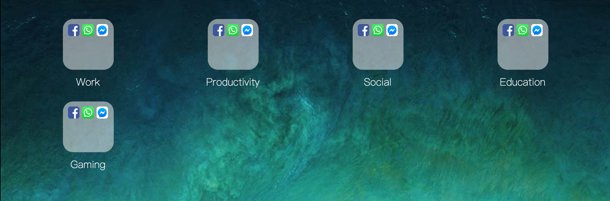
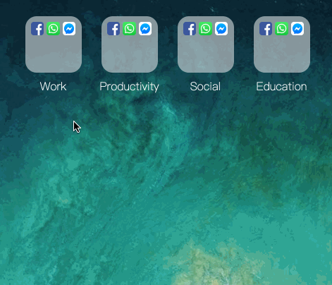
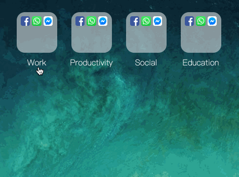

# react-ios-springboard


## steps

- `yarn add -D parcel-bundler`
- package.json

```json
{
  "scripts": {
    "watch": "parcel src/index.html"
  }
}
```

```html
// src/index.html
<!DOCTYPE html>
<html>
<head>
  <title>React iOS Springboard</title>
</head>
<body>
  <div id="app"></div>
  <script src="./index.js"></script>
</body>
</html>
```

```js
import React from 'React';
import { render } from 'react-dom';

render(<h1>Working</h1>, document.getElementById('app'));
```

- `yarn watch` 让 parcel 自动帮我们安装依赖

```js
// Root 组件，这也是一种创建方式吧
// src/components/Root/index.js
import Root from './Root';
export default Root;

// src/components/Root/Root.js
import React from 'react';

const Root = () => {
  return <h1>Root</h1>;
};

export default Root;
```

### 全局css初始化组件

```js
const GlobalStyle = createGlobalStyle`
  @import url('https://fonts.googleapis.com/css?family=Roboto:300&display=swap');

  html, body {
    margin: 0;
    padding: 0;
  }

  html, body, #app {
    width: 100%;
    height: 100%;
  }

  body {
    font-family: Roboto, sans-serif;
    font-weight: 300;
  }
`;
```

### Folder 组件

```js
const Springboard = ({ folders }) => {
  return <Wrapper>
    {folders.map(folder => (
      <Folder key={folder.id}/>
    ))}
  </Wrapper>;
};
```

### Folder 组件布局

```js
const Wrapper = styled.div`
  background: url(${ios11DefaultWallpaper});
  background-position: center;
  background-size: auto 100%;
  box-sizing: border-box;
  display: grid;
  grid-auto-rows: min-content;
  grid-gap: 1.25rem 1rem;
  grid-template-columns: repeat(4, 1fr);

  padding: 2rem;
  width: 60rem;
  height: 60rem;
`;
```



### OpenFolderBackdrop 组件

实现点击全屏背景模糊效果(单向)

```js
const Wrapper = styled.div`
  backdrop-filter: blur(20px);
  height: 100%;
  top: 0;
  left: 0;
  width: 100%;
  position: absolute;
`;

const OpenFolderBackdrop = ({isVisible}) => {
  return isVisible ? <Wrapper /> : null;
};
```



实现点击全屏背景模糊效果(双向)

```js
const Wrapper = styled(animated.div)`
  /* backdrop-filter: blur(20px); */
  height: 100%;
  left: 0;
  /* pointer-events: none; */
  position: absolute;
  top: 0;
  width: 100%;

  :hover {
    cursor: pointer;
  }
`;

const MAXIMUM_BLUR = 20;
const MINIMUM_OPEN_AMOUNT_ON_SHOW = 0.1;
const MINIMUM_OPEN_AMOUNT_ON_HIDE = 0.9;

const OpenFolderBackdrop = ({ isVisible, onClose: pushClose }) => {
  const spring = useSpring({
    openAmount: isVisible ? 1 : 0,
  });

  const style = {
    backdropFilter: spring.openAmount.interpolate(openAmount => `blur(${openAmount * MAXIMUM_BLUR}px)`),
    opacity: spring.openAmount,
    pointerEvents: spring.openAmount.interpolate(openAmount =>
      (isVisible && openAmount >= MINIMUM_OPEN_AMOUNT_ON_SHOW) ||
      (!isVisible && openAmount >= MINIMUM_OPEN_AMOUNT_ON_HIDE)
        ? 'auto'
        : 'none'
    ),
  };

  return <Wrapper onClick={() => pushClose()} style={style} />;
};
```

> 使用 ccs3-pointer-events 控制动画


